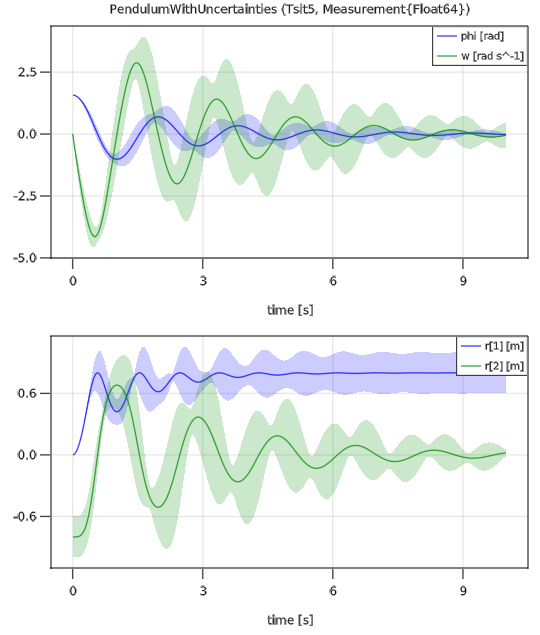

# Modia.jl

[](https://modiasim.github.io/Modia.jl/stable)
[](https://github.com/ModiaSim/Modia.jl/blob/master/LICENSE)

Modia is part of [ModiaSim](https://modiasim.github.io/docs/).

The [Modia Tutorial](https://modiasim.github.io/Modia.jl/stable/Tutorial.html) provides an introduction to Modia.

Modia is a Julia package for modeling and simulation of multidomain engineering systems (electrical, 3D mechanical, fluid, etc.) described by differential equations, algebraic equations, and (space-discretized) partial differential equations. It shares many powerful features of the
[Modelica language](https://www.modelica.org/modelicalanguage), together with new features not available in Modelica. 

Simulation is performed with [DifferentialEquations.jl](https://github.com/SciML/DifferentialEquations.jl), units are supported via [Unitful.jl](https://github.com/PainterQubits/Unitful.jl) , uncertainty modeling is performed with [Measurements.jl](https://github.com/JuliaPhysics/Measurements.jl), Monte Carlo simulation is performed with [MonteCarloMeasurements.jl](https://github.com/baggepinnen/MonteCarloMeasurements.jl). 

Plotting is performed with package [ModiaPlot.jl](https://github.com/ModiaSim/ModiaPlot.jl) as convenient interface to GLMakie.


## Installation

Modia and ModiaPlot are registered and are installed with (Julia >= 1.5 is required):

```julia
julia> ]add Modia, ModiaPlot
```

It is recommended to also add the following packages, in order that all tests and examples can be executed in your standard environment:

```julia
julia> ]add Measurements, MonteCarloMeasurements, Distributions
```

## Example

The following differential equations describes a damped pendulum:

```math
\begin{aligned}
 \frac{d\varphi}{dt} &= \omega \\
                   0 &= m \cdot L^2 \cdot \frac{d\omega}{dt} + d \cdot \omega + m \cdot g \cdot L \cdot sin(\varphi) \\
                   r &= \begin{pmatrix}
                           L*cos(\varphi) \\
                          -L*sin(\varphi)
                        \end{pmatrix}
\end{aligned}
```

where ``\varphi`` is the rotation angle, ``\omega`` the angular velocity,
``m`` the mass, ``L`` the rod length, ``d`` a damping constant,
``g`` the gravity constant and ``r`` the vector from the origin of the world system
to the tip of the pendulum. These equations can be defined, simulated and plotted with:

```julia
using Modia, ModiaPlot

Pendulum = Model(
   L = 0.8u"m",
   m = 1.0u"kg",
   d = 0.5u"N*m*s/rad",
   g = 9.81u"m/s^2",
   phi = Var(init = 1.57*u"rad"),
   w   = Var(init = 0u"rad/s"),
   equations = :[
          w = der(phi)
        0.0 = m*L^2*der(w) + d*w + m*g*L*sin(phi)
          r = [L*cos(phi), -L*sin(phi)]
   ]
)


pendulum1 = @instantiateModel(Pendulum)
simulate!(pendulum1, Tsit5(), stopTime = 10.0u"s", log=true)
plot(pendulum1, [("phi", "w"); "r"], figure = 1)
```

The result is the following plot:


Normally distributed uncertainty can be added, simulated and plotted
in the following way:

```julia
using Measurements

PendulumWithUncertainties = Pendulum | Map(L = (0.8 ± 0.2)u"m",
                                           m = (1.0 ± 0.2)u"kg",
                                           d = (0.5 ± 0.2)u"N*m*s/rad")

pendulum2 =  @instantiateModel(PendulumWithUncertainties,
                               FloatType = Measurement{Float64})

simulate!(pendulum2, Tsit5(), stopTime = 10.0u"s")
plot(pendulum2, [("phi", "w"); "r"], figure = 2)
```

resulting in the following plot:




